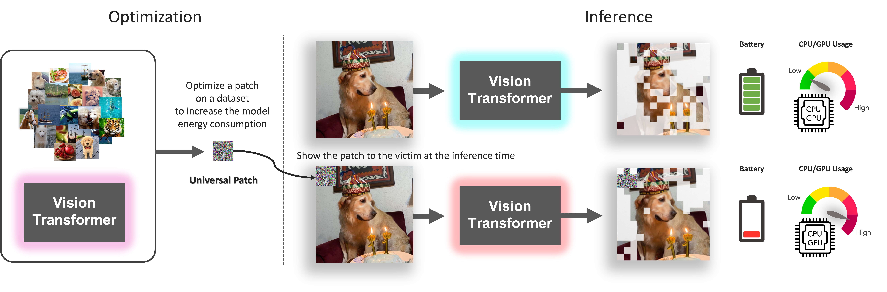

# SlowFormer: Universal Adversarial Patch for Attack on Compute and Energy Efficiency of Inference Efficient Vision Transformers

This Repository is an official implementation of SlowFormer.
Our code is based on [AdaVit](https://github.com/MengLcool/AdaViT), [A-ViT](https://github.com/NVlabs/A-ViT), and [ATS](https://adaptivetokensampling.github.io/). 

## Overview
We propose SlowFormer, an adversarial attack to reduce the computation / energy efficiency gains of efficient inference methods for image classification. The inference efficient methods we consider are input dependent - the network is dynamically altered (e.g. with dropout on tokens / transformer blocks) for each input and the level of efficiency is determined by the image. SlowFormer adds a universal adversarial patch to input images that makes the adaptive inference network to increase its compuation on the image, usually to its maximum possible value. We exeriment with three different inference efficient vision transformer methods - A-ViT, ATS and AdaViT and show that all the methods can be successfully attacked. A-ViT is particularly vulnerable to SlowFormer, with nearly 80% of maximum possible increase in compute with a patch of just 2% of image area. The attack on energy can be performed while preserving the task performance or simultaneously attacking it. The overview of the method is shown in the figure below.



## Train Patches

We provide the code for our adversarial patch attack on 3 methods: A-ViT,
AdaViT and ATS. We modify the publicly available codebases for these approaches
to include our attack.

### A-ViT

```sh
cd A-ViT
bash run.sh
```

### AdaViT

```sh
cd ada_vit
bash run.sh
```
